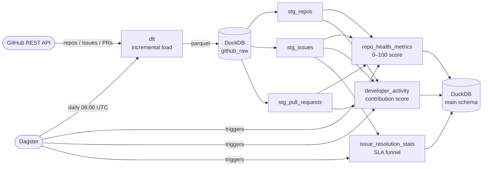
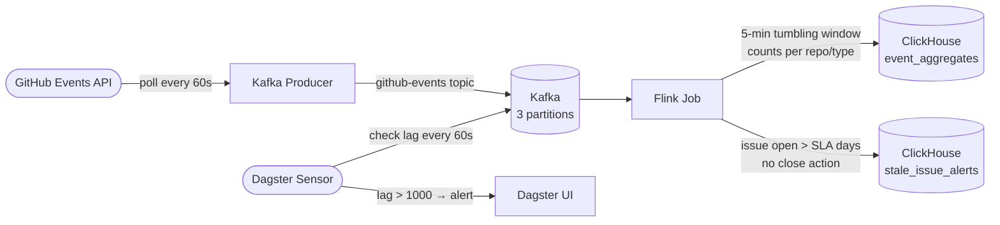

# GitHub Pulse — Open Source Health Monitor

Maintaining an open source project is mostly flying blind.

You get a flood of issues and PRs, no clear picture of what's urgent, and no signal on whether your community is growing or slowly dying. GitHub's built-in UI gives you raw counts — it doesn't tell you anything actionable.

GitHub Pulse fixes that. It's a data platform for open source maintainers and engineering teams that own or depend on open source libraries. It turns raw GitHub activity into operational intelligence: what needs attention, what's trending, and what's at risk.

**GitHub tells you what happened. GitHub Pulse tells you what to do about it.**

---

## What It Does

- **Detects stale issues** — surfaces issues open 30+ days with no maintainer response, so you know where to focus
- **Tracks contributor retention** — are new contributors coming back, or is everyone a one-time drive-by?
- **Measures PR velocity** — how long from open to merge, and is it getting slower over time?
- **Flags dependency risk** — repos your project depends on that are going quiet (no commits, piling issues)
- **Surfaces community health trends** — is engagement growing or declining over the last 90 days?

---

## Architecture

```
┌─────────────────────────────────────────────────────────────────┐
│                        DATA SOURCES                             │
│         GitHub REST API              GitHub Events API          │
└────────────────┬────────────────────────────┬───────────────────┘
                 │                            │
                 ▼                            ▼
         ┌──────────────┐           ┌──────────────────┐
         │     dlt      │           │  Kafka Producer  │
         │ (batch load) │           │ (event streaming)│
         └──────┬───────┘           └────────┬─────────┘
                │                            │
                ▼                            ▼
┌──────────────────────────────────────────────────────────────────┐
│                  RAW LAYER (DuckDB / Iceberg on MinIO)           │
│         repositories │ issues │ pull_requests │ github_events    │
└──────────────────────────────┬───────────────────────────────────┘
                                │                  ▲
                    ┌───────────┘          ┌───────┴────────┐
                    ▼                      │   Apache Flink  │
             ┌────────────┐               │ (stream process)│
             │    dbt     │               └───────┬─────────┘
             │(transform) │                       │
             └──────┬─────┘                       │
                    │                             │
                    ▼                             ▼
┌──────────────────────────────────────────────────────────────────┐
│                     CURATED LAYER                                │
│  repo_health_metrics │ developer_activity │ issue_resolution     │
│              event_aggregates (5-min windows)       [Phase 2]    │
└────────────────────────────┬─────────────────────────────────────┘
                             │
           ┌─────────────────┼──────────────────┐
           ▼                 ▼                  ▼
    ┌────────────┐   ┌──────────────┐   ┌─────────────┐
    │ ClickHouse │   │    Feast     │   │   Qdrant    │
    │ (analytics)│   │ (features)   │   │  (vectors)  │
    │ [Phase 2]  │   │ [Phase 3]    │   │ [Phase 3]   │
    └────────────┘   └──────────────┘   └─────────────┘
           │                 │                  │
           └─────────────────┼──────────────────┘
                             ▼
                    ┌─────────────────┐
                    │    Dagster      │
                    │ (orchestration) │
                    └─────────────────┘
```

---

## Stack

| Layer | Tool | Why |
|---|---|---|
| Batch ingestion | dlt | Lightweight, incremental by default, faster to iterate than Airbyte |
| Streaming ingest | Kafka + Python producer | Industry standard event backbone |
| Stream processing | Apache Flink | Low-latency stream processing for real-time issue detection |
| Table format | Apache Iceberg | The open table format — Snowflake, Databricks, and AWS all support it |
| Local storage | DuckDB (dev) / MinIO (prod) | DuckDB for fast local iteration; MinIO for S3-compatible Iceberg storage |
| Transformations | dbt | Curated health metrics and retention models |
| Analytics DB | ClickHouse | Fast OLAP, handles real-time event aggregates well |
| Feature store | Feast | Contributor churn features for ML models |
| Vector DB | Qdrant | Semantic search across repo issues and descriptions |
| Orchestration | Dagster | Asset-aware, code-first orchestration with daily schedule |
| Data quality | dbt tests + Great Expectations | 19 tests validating shape, uniqueness, and value ranges |

---

## Project Phases

### Phase 1 — Batch Lakehouse ✅

Ingest historical GitHub data and build the core health metrics.



**What's running:**
- dlt pipeline ingesting incrementally via `updated_at`:
  - 2,681 repositories across 4 data engineering topics
  - 1,383 issues from 5 tracked projects (Apache Iceberg, Flink, Kafka, dbt, Dagster)
  - 25,000 pull requests
- dbt models (19 tests, all passing):
  - `stg_repos`, `stg_issues`, `stg_pull_requests` — clean staging views
  - `repo_health_metrics` — composite score (0–100): stars + issue close rate + PR merge rate + recency
  - `developer_activity` — contribution scores per developer per repo
  - `issue_resolution_stats` — SLA funnel: % of issues closed within 1 / 7 / 30 days
- Dagster assets wired up with daily 06:00 UTC schedule

**Sample output:**

| Repo | Stars | Health Score | PR Merge Rate |
|---|---|---|---|
| dagster-io/dagster | 16,092 | 64.4 | 70.4% |
| apache/superset | 74,593 | 50.0 | — |
| apache/airflow | 46,700 | 49.8 | — |

Apache Iceberg issue SLA: 69% close rate, median 195 days to close, only 20% resolved within 7 days.

**Skills demonstrated:** dlt, dbt, DuckDB, Dagster, incremental loading, data quality testing

---

### Phase 2 — Real-Time Stale Issue Detection ✅

Add a streaming layer that catches problems as they happen — not 24 hours later when the batch runs.



**What's running:**
- Kafka producer polling GitHub Events API every 60s, deduplicating in-memory, publishing to `github-events` (3 partitions)
- Flink job with two pipelines:
  - 5-minute tumbling window aggregations (event count per repo + type) → `event_aggregates`
  - Stale issue detection (IssuesEvents open > SLA threshold) → `stale_issue_alerts`
- ClickHouse tables for real-time query access
- Dagster sensor polling consumer group lag every 60s, surfaces alert in UI when lag > 1000

**Why streaming matters here:** A stale issue caught in 5 minutes can be triaged before it gets buried. Catching it in 24 hours (batch) means it's already in a contributor's bad experience.

**Skills demonstrated:** Kafka, Apache Flink, stream windowing, ClickHouse real-time ingestion, Dagster sensors

---

### Phase 3 — Contributor Churn Prediction ✅

Predict which contributors are about to disengage so maintainers can reach out before they're gone.

**What's running:**
- `contributor_churn_features` dbt model — 3,919 contributors scored 0–1 using a rule-based weighted formula: 50% recency + 35% frequency decline + 15% engagement drop
- Feast feature store: `contributor_activity` FeatureView (7-day TTL), `churn_prediction_v1` FeatureService, SQLite online store backed by parquet offline store
- Feature materialization runs downstream of dbt via Dagster, pushes features into the online store for low-latency serving
- Embedding pipeline: 1,383 issues vectorized with `all-MiniLM-L6-v2` (384-dim, CPU, no API key) and upserted into Qdrant — enables "find issues similar to this one" for faster triage

**Skills demonstrated:** Feast, feature stores, vector embeddings, Qdrant, semantic search, ML/DE boundary, feature serving

---

## Takeaways

**Phase 1** taught me that incremental loading is harder than it looks. dlt handles the cursor logic, but you still have to think carefully about what "updated" means for each resource — repos, issues, and PRs all have different update semantics. dbt's ref() graph makes dependencies explicit in a way that ad-hoc SQL scripts never do.

**Phase 2** clarified why streaming and batch coexist. Flink isn't a replacement for dbt — it's for the class of problems where 24-hour latency is the wrong answer. Stale issue detection is one of those. The Dagster sensor watching Kafka lag was the most practical thing I built: operational visibility is part of the pipeline, not an afterthought.

**Phase 3** showed me where the DE/ML boundary actually is. A feature store isn't magic — it's a contract between the team that produces features and the team that consumes them. Feast enforces that contract. The embedding pipeline was a reminder that "ML" doesn't have to mean training a model: semantic search over issue titles is useful on its own, and MiniLM running on CPU is fast enough to embed 1,383 issues in under two minutes.

The broader lesson: the stack here — dlt, dbt, DuckDB, Kafka, Flink, Feast, Qdrant, Dagster — has real seams between tools. Each handoff (DuckDB → parquet → Feast, dbt mart → Dagster asset → Qdrant) is a place where things can break, and understanding those seams is what separates knowing the tools from knowing how to use them together.

---

## Quickstart

**Prerequisites:** Docker, Docker Compose, Python 3.11+, GitHub personal access token

```bash
# 1. Clone and configure
git clone https://github.com/xingvoong/data_engineering
cd data_engineering
cp .env.example .env
# set GITHUB_TOKEN in .env

# 2. Create virtual environment
python3.11 -m venv .venv
source .venv/bin/activate
pip install -r requirements.txt

# 3. Run batch ingestion (writes to local DuckDB)
python ingestion/batch/github_pipeline.py

# 4. Run dbt transformations
cd processing/dbt
dbt deps
dbt run

# 5. Run tests
dbt test

# 6. Start Dagster UI  (optional)
cd ../..
dagster dev -f orchestration/dagster/__init__.py
# open http://localhost:3000

# 7. Start Docker services for full stack (MinIO + ClickHouse)
make up
```

---

## Project Structure

```
data_engineering/
├── docker-compose.yml          # MinIO, ClickHouse, Kafka, Flink, Qdrant
├── .env.example                # Environment variable template
├── Makefile                    # Commands for every layer
├── requirements.txt            # Python dependencies
├── ingestion/
│   ├── batch/                  # dlt pipeline (repos, issues, PRs) ✅
│   └── streaming/              # Kafka producer (GitHub Events API) ✅
├── processing/
│   ├── flink/                  # PyFlink streaming jobs ✅
│   └── dbt/                    # Staging + mart models, 24 tests ✅
├── storage/
│   └── clickhouse/             # ClickHouse table definitions for streaming layer
├── features/
│   ├── feast/                  # Feature store config, feature views, materialization ✅
│   └── vectors/                # MiniLM embedding pipeline, Qdrant upsert ✅
├── orchestration/
│   └── dagster/                # Assets, jobs, schedules, sensors ✅
└── tests/                      # Unit + integration tests for all three phases ✅
```
